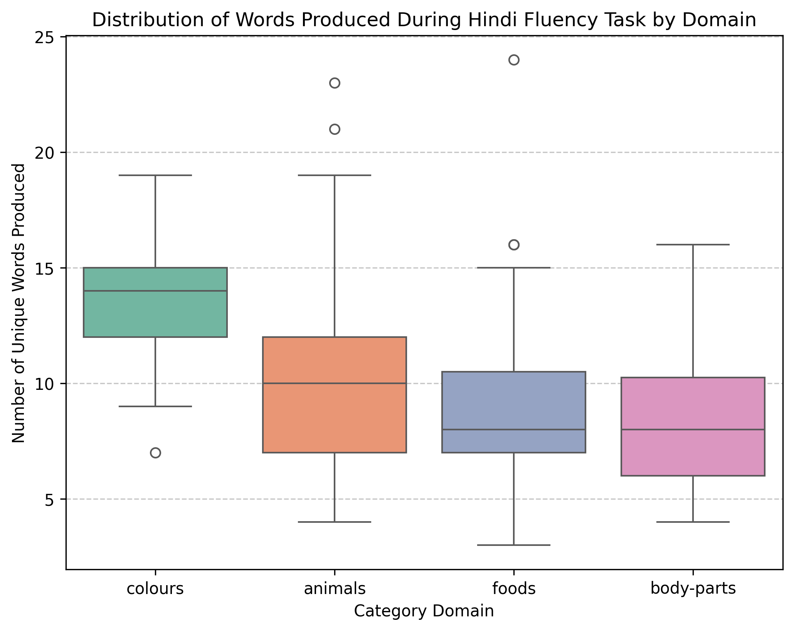
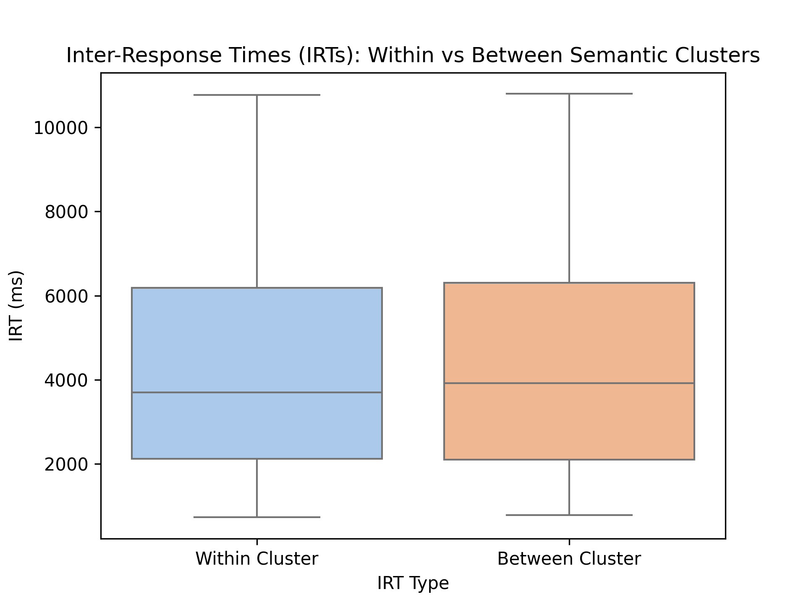
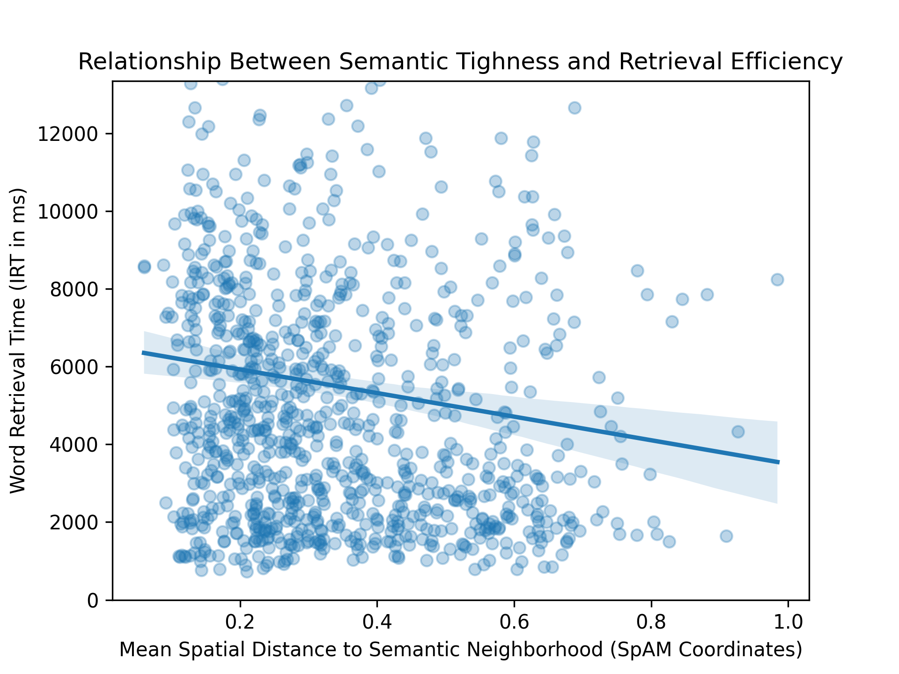
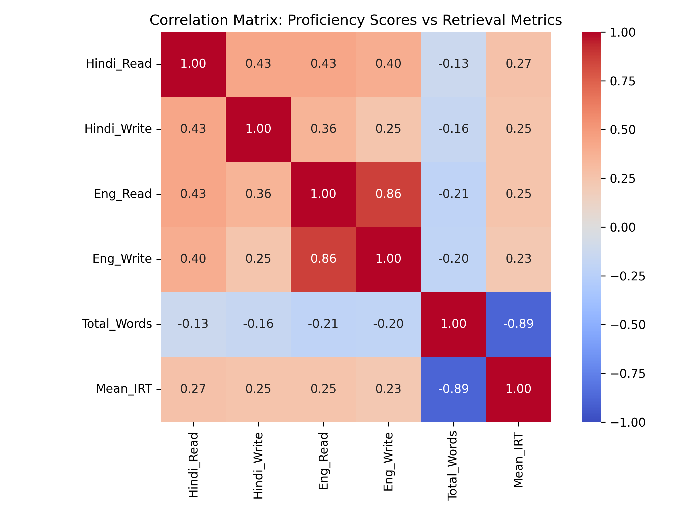
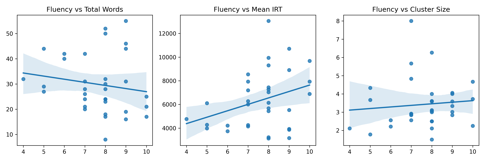
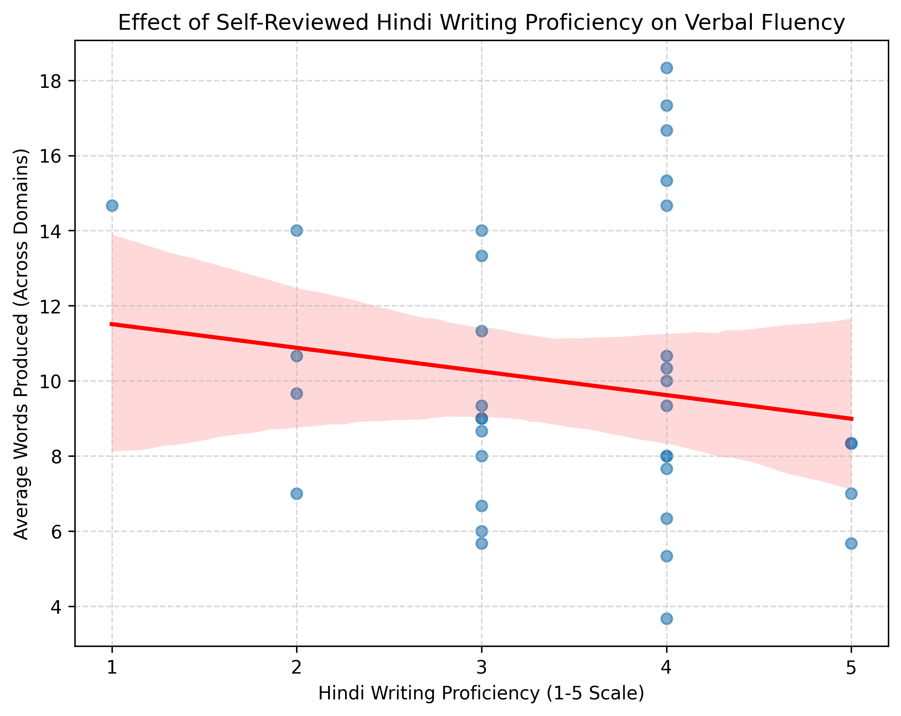

# Hindi Fluency and Semantic Organization: A Comprehensive Statistical Analysis
## Final Consolidated Report

**Date:** Feb 21, 2025  
**Topic:** Hindi Fluency Dataset Analysis – Spatial & Temporal Metrics

---

## 1. Introduction and Statistical Thinking
Verbal Fluency Tests (VFT) are widely utilized in neuropsychological and psycholinguistic research to evaluate an individual's lexical retrieval efficiency, executive control, and semantic memory organization. In a typical semantic (or categorical) VFT, participants are required to produce as many unique words belonging to a specific category (e.g., *animals*, *foods*, *colours*) within a limited 60-second timeframe. 

The primary purpose of psychological and linguistic statistics is moving beyond common sense or anecdotal assumptions regarding language proficiency to evaluate structured claims. In investigating how Hindi speakers map their mental lexicons, it naturally appears intuitive that higher fluency causes faster cognitive access. Yet statistical reasoning forces us to address **confounding variables**—external influences that can mask true effects. In a browser-based behavioral study, factors such as QWERTY typing speed, digital literacy, and native language instruction duration operate as heavy confounds. A participant typing slowly on an English alphabet keyboard configuring Hindi translations may not actually suffer from slow cognitive retrieval. Deploying **statistical literacy** involves measuring base rate phenomena alongside these physical bottlenecks to appropriately identify "False Positives" measuring cognitive behavior.

### Explanation of the Dataset
The dataset utilized (`responses.json`) encompasses responses generated via an online cognitive experiment framework targeting Hindi fluency and spatial arrangements among $N=35$ participants. The specific logic block sequences are:
1. **Demographics:** Surveys isolating participant age, location, and self-ratings concerning their English and Hindi proficiencies (1–5 Likert scale).
2. **Verbal Fluency Task (VFT):** Prompting textual generation of items across specific semantic categories (`animals`, `foods`, `colours`, `body-parts`).
3. **Spatial Arrangement Method (SpAM):** Tracking how participants manipulate their self-generated VFT arrays on a 2D Euclidean canvas, utilizing spatial distance to proxy perceived "semantic distance."

---

## 2. Research Design, Measurement, and Operationalization

Translating abstract psycholinguistics into pure mathematical inference leverages the design principle of **operationalization**. Unseen constructs are made measurable via following structures:
- **Retrieval Efficiency** is operationalized as the temporal Inter-Response Time (IRT) tracked in milliseconds between sequentially logged items.
- **Semantic Clustering** is operationalized utilizing continuous $X, Y$ coordinate maps extracted during SpAM tasks, aggregated via mathematical distance boundaries.
- **Fluency Constructs** are operationalized mathematically as numeric integers ranging between 1-5 via self-assessment protocols.

### Reliability, Validity, and Sampling
To bear scientific weight, a given metric must exhibit **reliability** (consistent outputs across testing instances) and **validity** (measuring what it explicitly promises to measure). SpAM techniques demonstrate high validity mapping human spatialization traits to cognitive proximity constraints. 

Regarding implementation, the utilized $N=35$ sample represents a convenience paradigm over a purely formalized Simple Random Sampling procedure. As a result, specific **biased sampling risks** mandate cautious generalization; these digital metrics primarily scale toward computer-literate, younger bilingual Hindi environments rather than rural vernacular monoliths. Lastly, strict separation between **Units of Analysis** were enforced across analytical states; grouping subjects for overall demographic metrics while isolating distinct conceptual cluster transitions (numbering in the hundreds) to power algorithm-heavy IRT tests.

---

## 3. Data Visualization and Summarization Principles

Modern inferential data science heavily necessitates plotting baseline descriptive matrices to parse structural topology prior to launching Hypothesis inquiries. 

### Variable Typologies
- **Nominal Data:** Distinct spatial domains such as `foods` or `animals` possessing zero inherent arithmetic ranking properties.
- **Ordinal Data:** Ranked data intervals. The rating step increasing from Hindi Writing ability 3 to 4 is not guaranteed identical structural growth as transitioning from a 1 to a 2.
- **Continuous Variables:** Millisecond timestamp records (IRT) and normalized mathematical SpAM distances, which operate practically towards infinity.

### Descriptive Statistics and Visual Integrity
To map topographical results, geometric summaries relying heavily on metrics of **Central Tendency** (Means and Medians) contextualize the average data center. Variances around this baseline define broad **Variability**. If an individual participant outputs a significantly warped standard deviation in chronological IRT logs, behavioral literature suggests active cognitive clustering schemas function efficiently, followed immediately by sharp switching delays to new semantic pathways.

In visual design protocols, color integrity mapping utilized strict pastel hierarchies strictly avoiding red-green exclusionary boundaries. Visual aggregation axes remain locked to zero bases so shape skewing distributions are not superficially hidden.

---

## 4. Probability and Distributions

The crux of the dataset rests explicitly on separating descriptive artifacts from true theoretical distributions framing broader **Probability vs Statistics** domains. Probability frameworks predict downstream behavior parameters strictly from a perfectly theoretical model. Statistics flips the pipeline, inferring the overarching hypothetical model utilizing granular behavioral timestamps.

Through the Central Limit Theorem framework, group-level semantic aggregates track firmly alongside the standard **Normal Distribution**—the bell curve standard anchoring significance tests. Yet when slicing dataset segments heavily (e.g. matching only items perfectly logged simultaneously alongside SpAM records for a single task module), the sample size actively constricts. As degrees of freedom fall, tracking distribution shapes adjusts down to utilize **t-distributions** mapping heavier probability boundaries towards standard deviation tails to accommodate finite variance boundaries.

---

## 5. Statistical Hypothesis Testing Framework

Interrogating specific behavioral RQs requires a frequentist protocol deploying fixed thresholds regarding analytical claims:

1. **The Null Hypothesis ($H_0$):** Postulates that semantic outputs are entirely random and absolutely no causal geometric correlation exists within mental Hindi lexicons regarding IRT latencies. 
2. **The Alternative Hypothesis ($H_a$):** Supposes true statistically quantifiable metric shifts governing clustered lexicons.

Statistical runs return a fixed **P-value**. The P-value calculates the probability of viewing testing data purely assuming that the null hypothesis is completely true. Standard cognitive research locks evaluating **Significance Levels ($\alpha$)** strictly to $0.05$. Drifting above this boundary yields failures toward rejecting the Null. Incorrectly assuming true statistical differences triggers **Type I errors** (False Positives), whereas ignoring actual effects buried mathematically due to high dataset noise sparks **Type II errors** (False Negatives).

---

## 6. Comprehensive Results and Analytical Findings

### Part A: Overall Fluency Output by Domain
Participants successfully navigated testing domains yielding unique total outputs dynamically scaling by distinct category requirements.
- **Colours:** $M = 13.36$, $SD = 3.41$
- **Animals:** $M = 10.43$, $SD = 4.60$
- **Foods:** $M = 9.31$, $SD = 4.09$
- **Body Parts:** $M = 8.58$, $SD = 3.08$

Narrow structural arrays (`colours`) induced rapid exhaustive output lists compared directly against spatially wide semantic concepts mapping heavily toward conceptual subgroups (`animals` vs `body parts`). 

  

### Part B: Spatially Formatted Lexicon Searching (RQ1 & RQ2)
*RQ1: Do Hindi speakers retrieve words in semantic clusters rather than randomly?*
Deploying SpAM spatial arrays against timing outputs allowed strict structural clustering comparisons mathematically splitting intra-cluster jumps against extra-cluster switching:
- **Mean Within-Cluster IRT:** $4732.07$ ms
- **Mean Between-Cluster IRT:** $4922.72$ ms
- Welch's t-test: $t = -0.841, p = 0.400$ ($p > 0.05$)

Statistically, moving physically between perceived conceptual networks produced negligible latency constraints over remaining locked strictly within continuous clusters mapping identical parameters.

*RQ2: Do faster retrievals reflect tighter semantic neighborhoods?*
Converting mapping arrays explicitly down to unformatted continuous coordinate distances, analyses demonstrated negligible impact predicting IRT outputs against isolated adjacent jumps ($p=0.473$). Yet plotting **Mean Spatial Neighborhood** (averaging distances measuring solitary lexical terms scaled against remaining category outputs) yielded statistically significant results ($r = -0.117$, $p = 0.00024$).

  

Inverted inverse negative scaling highlights an inherent paradox regarding retrieval—lexical units forced dramatically wider across SpAM matrices conceptually parsed functionally *faster* overall.

### Part C: Fluency Metrics and Total Interaction Predictors (RQ3)

To isolate exact structural covariances operating amongst generalized reading schemas, raw numerical inputs were collapsed directly into standard correlation matrices. Generating standard output scales across generalized arrays (Figure 4) visually demonstrates flat tracking interactions between self-graded reading scores and absolute experimental success rates. 

  

*RQ3: Does Hindi fluency strictly predict lexical retrieval efficiency?*
Because extracting statistical correlations sequentially across independent dimensions inflates random chance boundaries dramatically (The Problem of Multiple Comparisons), testing Fluency ratings explicitly requires strict **Bonferroni corrections** driving acceptable statistical alphas down drastically ($\alpha_{corrected} = 0.0167$).

Operating under rigid mathematical correction caps:
- Fluency vs Total Word Generation ($p=0.376$)
- Fluency vs Subject Mean IRT ($p=0.060$)
- Fluency vs Calculated Cluster Scope ($p=0.592$)
Subjective skill appraisals universally map completely disconnected from objective browser outputs indicating significant dataset interaction confounds primarily based off unmeasured keyboard/hardware discrepancies heavily buffering absolute fluency translation capability.

  

  
---

## 7. Conclusions and Final Outcomes

In merging Euclidean distance arrays charting subjective semantic models coupled beside raw fractional reaction timestamps derived from VFT constraints ($N=35$), data topologies outline distinct boundaries surrounding modern conceptual psycholinguistics. Operating deeply structural distance boundaries (SpAM), participants yielded highly individualized arrays mapping distinct localized groupings. However, translating geometry explicitly directly towards temporal latency models produced statistically flat inferences representing relatively seamless transitioning mechanisms capable of bypassing overarching neighborhood groupings gracefully. Furthermore, broad demographic fluency interactions collapsed utterly flat indicating generalized Hindi abilities represent heavily fractured predictors calculating objective task efficiency. Resolving psycholinguistic output distributions ultimately mandates severe mathematical control scaling physical keyboard bounds and strict correction thresholds against sweeping cognitive inferences. 

### 8. Citations and Relevant Literature
1. Dautriche, I. et al. (2016). *Wordform similarity increases with semantic similarity: an analysis of 100 languages*. Cognitive Science. [https://colala.berkeley.edu/papers/dautriche2016wordform.pdf]
2. Koch, G. E., et al. (2016). The Spatial Arrangement Method (SpAM) of measuring similarity. *Behavior Research Methods*, 48, 442–456.
3. Lezak, M. D., Howieson, D. B., Bigler, E. D., & Tranel, D. (2012). *Neuropsychological assessment*. Oxford university press.
4. Semantic Modeling in Bilingual Lexicons. Pre-Print Archive. [https://osf.io/preprints/psyarxiv/2bazx_v1]
